# 微信 Android 最大字体 11 页视觉与语义审计（2026-09-01）

## 结论

`official Android fontSizeSetting=26 result: passed, no product change required`

本轮在官方微信开发者工具的 Nexus 5X / Android 5.0 运行时中，把微信字体从原默认档 `16` 临时切到该工具可选列表的最大档 `26`，覆盖全部 11 个原生页面，并把每张接受截图与 `docs/design/visual-concept-v1.1.png` 放在同一比较输入中检查。

- 未发现 P0、P1 或 P2：没有可见横向溢出、文字裁切、异常基线漂移、按钮文字挤压、危险操作层级错位或数据语义错位。
- 大字号显著增加纵向占用，长页面需要更多滚动；这是预期的可访问性代价，不构成内容不可达或交互失效。
- 搜索、History、Run、Local-first 数据说明和高风险重置在最大字体下仍表达同一事实，没有用视觉调整改写领域数据。
- 本轮没有产品代码缺陷，因此没有为了制造 diff 而修改实现，也没有重复上传与已验证包内容相同的体验构建。
- 审计结束后已恢复两份开发者工具原始状态文件，并由官方运行时再次确认 `fontSizeSetting=16`。

该结论只覆盖本轮官方 Android 模拟器、Nexus 5X 纵向窗口和已截图状态。它不能替代物理 Android / iPhone 微信、屏幕阅读器、系统分享面板、聊天文件选择、日历授权或切后台恢复的真实用户手势验证。

## 环境与证据来源

- 官方微信开发者工具：`2.02.2608060`
- wechatide skill：`0.3.9`
- WeChatLib：`3.17.2`
- 设备：`Nexus 5X`
- 系统：`Android 5.0`
- 逻辑屏幕：`411 × 731`
- 页面窗口：`411 × 663`
- pixel ratio：`2.625`
- 审计字体设置：`26`（当前开发者工具列表最大档）
- 恢复后字体设置：`16`（原默认档）
- 截图：官方接口输出原始 PNG，14 张均为 `888 × 1580`
- 视觉参照：`docs/design/visual-concept-v1.1.png` 与已实现微信视觉系统
- 事实来源：当前测试号本地数据岛；运行时无产品账号、无云同步、无产品网络请求

本目录中的截图均在 2026-09-01 本轮运行中重新捕获并逐张打开检查。旧截图只用于理解既有方向，不替代本轮证据。

## 编号审计步骤与健康度

| # | 审计步骤 | 重点与实际结果 | 健康度 |
|---:|---|---|---|
| 1 | 建立最大字体运行时 | 官方 `systemInfo` 回读 Nexus 5X、411 × 731、窗口 411 × 663、DPR 2.625、SDK 3.17.2、`fontSizeSetting=26` | `passed` |
| 2 | 首页 | Hero、信任说明、搜索/新建、计划/历史导航、继续卡、官方精选卡在大字号下正常换行；无横向溢出或按钮裁切 | `passed` |
| 3 | 当前 Run | 关键徽标、标题、状态、条件说明、成对动作和底部操作坞保持清晰；纵向密度增加但内容可滚动到达 | `passed` |
| 4 | 模板列表 | 长说明、搜索/新建、官方卡标题与动作正常换行；列表没有被大字号挤出屏幕 | `passed` |
| 5 | 模板详情 | 收藏、隐藏入口、另存个人副本、项目列表以及“安排计划 / 开始检查”均完整可见 | `passed` |
| 6 | 计划 | Local-first 说明、picker、日历开关、保存按钮和空态保持层级；长文案自然回流 | `passed` |
| 7 | 历史 | 关闭状态、计数、长 ISO 时间戳和两列动作完整；没有把历史事实写成当前 Run | `passed` |
| 8 | 历史详情 | 顶部冻结事实与底部重开/重新开始/复制/分享动作均检查；主次关系和历史身份不变 | `passed` |
| 9 | 数据与备份 | 双数据岛、备份非云同步、能力实况、高风险清空强确认均完整；危险区没有被字号挤压或弱化 | `passed` |
| 10 | 搜索 | 真实输入“护照”后只返回 1 个“出国旅行”，400 分，命中“场景别名、检查项”；开始/详情动作完整 | `passed` |
| 11 | 个人模板编辑 | 官方副本说明、预览、12 项文本域、中文“勾选 / 玉绿”picker 与保存按钮均可达；未调用保存 | `passed` |
| 12 | 全部进行中 | 首页优先标记、0 / 12、未确认 12、关键 2、长时间戳与继续按钮完整；继续按钮实测 `46 × 48px` | `passed` |
| 13 | 非视觉与数据回读 | console 对 `error|warn|fail|exception` 无匹配；network 无请求；数据页仍为 5 Run、0 计划、0 个人模板 | `passed` |
| 14 | 恢复开发工具状态 | 关闭项目窗口，按 SHA-256 对应恢复两份原状态文件，JSON 回读均为 `current=16`；重开后官方 `systemInfo` 确认 `fontSizeSetting=16` | `passed` |

## 正式接受截图

### 1. 首页

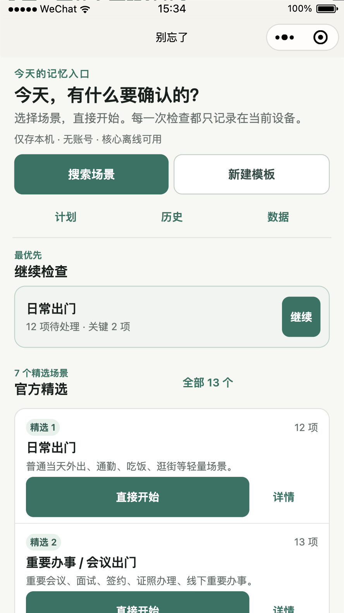

首页长标题、双主动作、快捷入口和继续检查卡均未发生文字偏心或横向裁切。

### 2. 当前 Run

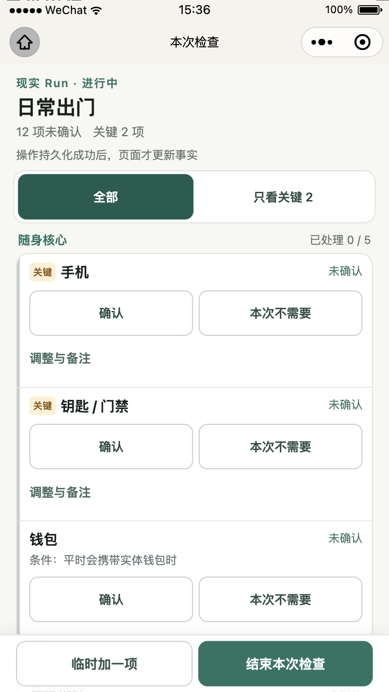

关键徽标、项目名、条件和状态保持同一行内语义；确认与“本次不需要”仍是独立动作。

### 3. 模板列表

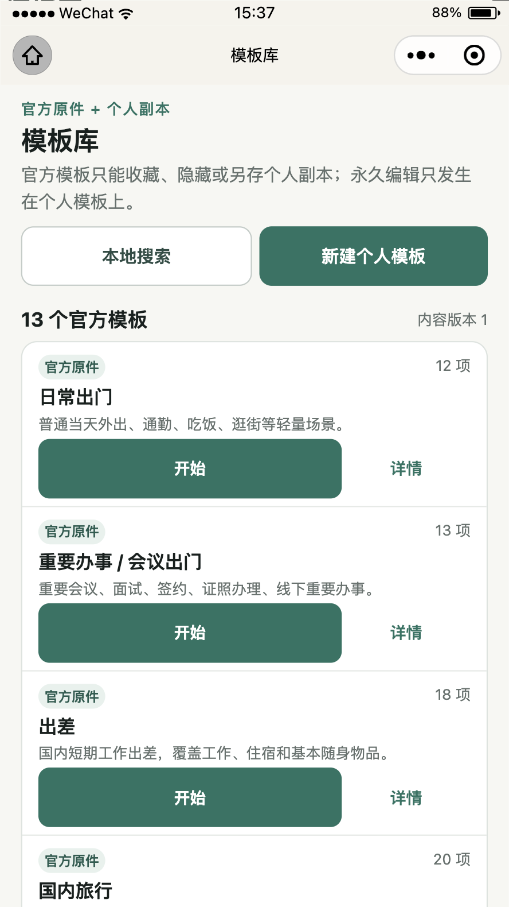

官方模板长说明自然换行；搜索、新建与卡片动作均在 411px 宽度内。

### 4. 模板详情

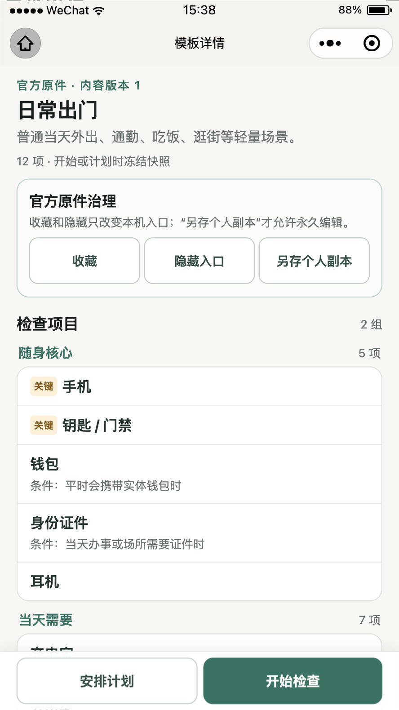

模板治理动作和检查项列表没有因字号变大丢失或重叠。

### 5. 计划

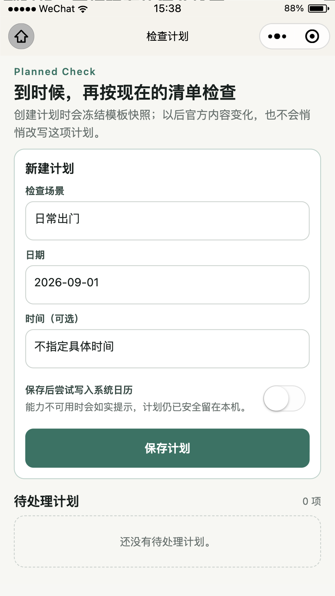

表单控件、说明与空态保持清晰层级，未见 label/input 基线漂移。

### 6. 历史

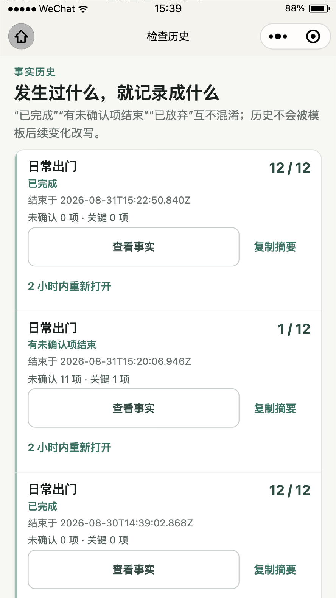

关闭事实、计数和长时间戳可读，状态不依赖颜色单独表达。

### 7. 历史详情顶部

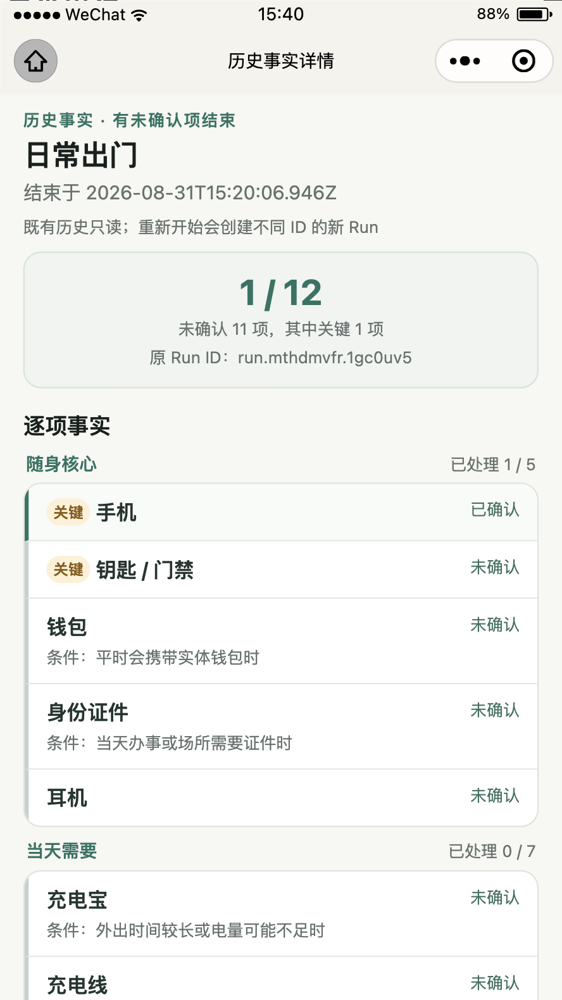

冻结 Run 身份、总计和逐项未确认状态保持一致。

### 8. 历史详情后续操作

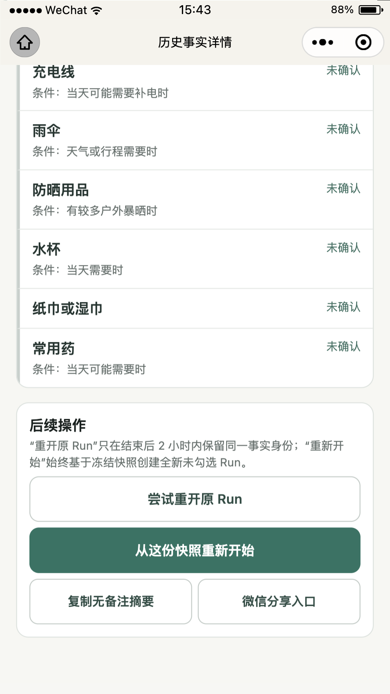

“从这份快照重新开始”仍为主动作；重开、复制与分享未被误提升为同等级主动作。

### 9. 数据与备份顶部

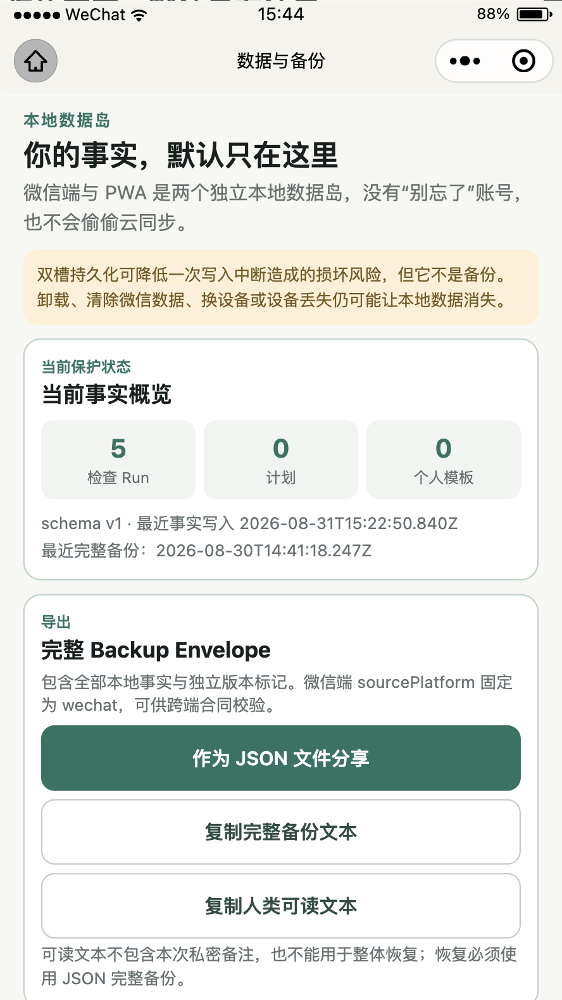

本地数据岛与“双槽不是备份”的边界位于备份动作之前，5 / 0 / 0 事实计数完整。

### 10. 数据高风险区

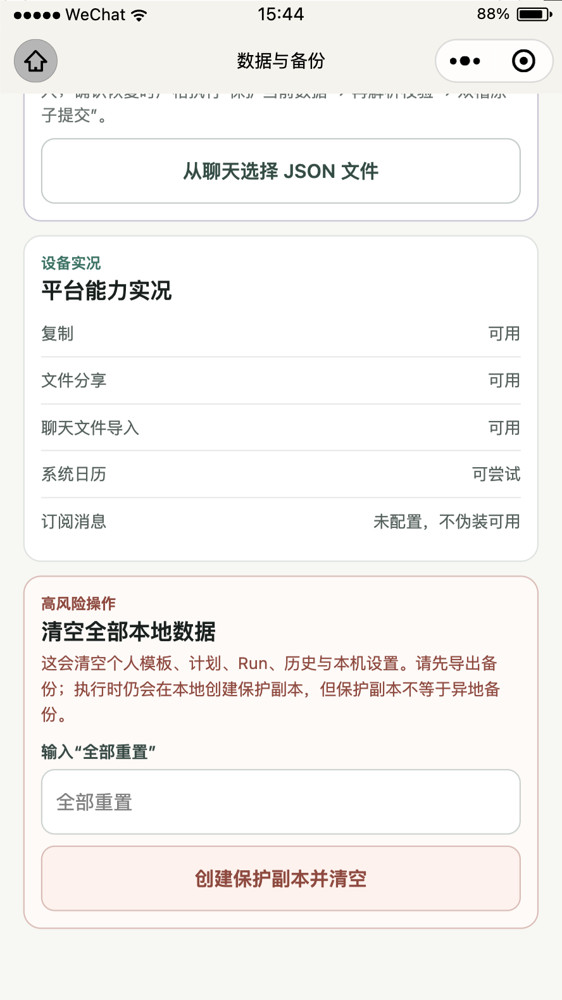

平台能力逐项诚实展示；清空操作仍要求输入“全部重置”，危险文案、输入和按钮都完整可见。

### 11. 搜索结果

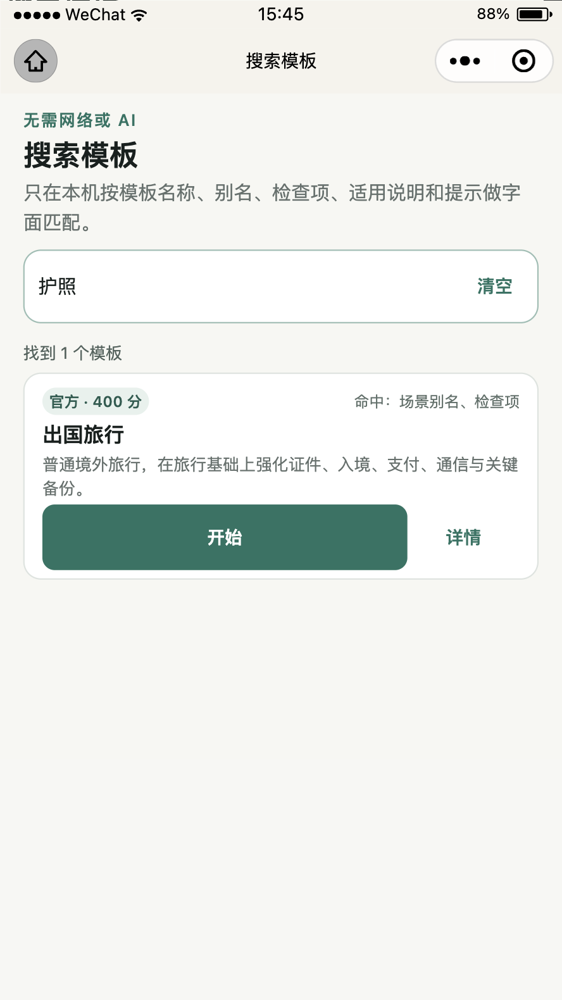

输入“护照”后真实回读 1 个官方模板；命中来源、适用说明、开始与详情按钮均未溢出。

### 12. 个人模板编辑顶部

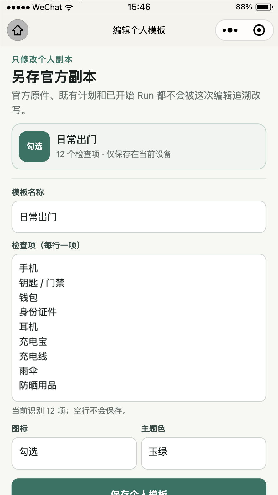

页面明确“另存官方副本”，不会让用户误以为正在改写官方原件或既有 Run。

### 13. 个人模板编辑保存区

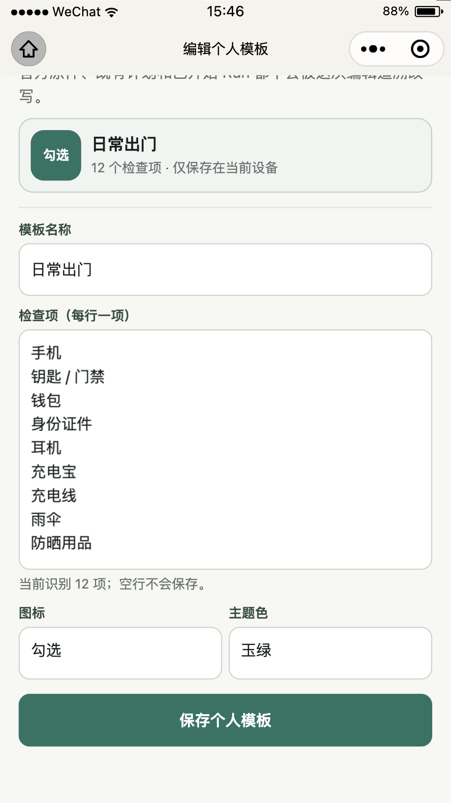

12 项文本域、帮助文案、中文 picker 和保存按钮均可滚动到达；本轮未保存，因此没有创建个人模板。

### 14. 全部进行中

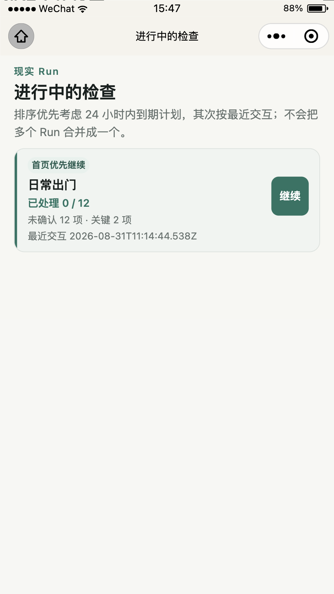

当前只有 `run.mth55nei.4f280b`；页面没有合并 Run，继续按钮在最大字体下仍为 46 × 48px。

## 数据语义一致性回读

审计只执行打开、输入搜索词、滚动、截图、元素尺寸读取和页面数据读取，没有触发开始、保存、结束、重开、备份或清空动作。结束前数据页实际回读：

```text
checkRuns          5
plannedChecks      0
personalTemplates  0
schemaVersion      1
updatedAt          2026-08-31T15:22:50.840Z
```

搜索页面实际回读：

```text
query        护照
total        1
templateId   official.international_travel
title        出国旅行
score        400
matchLabel   场景别名、检查项
```

这与冻结搜索合同、当前本地事实和默认字体审计结果一致。大字体审计未创建、修改或删除任何产品事实。

## 工具结果与边界

```text
official runtime before audit  fontSizeSetting=26
official screenshot capture    14 / 14 PASS（888 × 1580 PNG）
official 11-page visual audit   PASS
console error/warn filter       empty
network request list            empty
data invariants                 unchanged
tool state restored             fontSizeSetting=16
```

证据写入后使用项目固定的 Node.js 24 / pnpm 11.19.0 重新执行：

```text
runtime:check        PASS
frozen install       PASS（Already up to date）
content:check        PASS（Markdown = shared JSON = 微信派生 JS）
lint                 PASS
typecheck            PASS
test                 PASS（31 files, 158 tests）
build                PASS（35 precache entries, 573.51 KiB）
verify:boundaries    PASS（41 authored files, 40 production files）
miniprogram:verify   PASS（11 pages, 13 templates, 247764 bytes）
e2e                  PASS（8 / 8）
git diff --check     PASS
```

页面刚切换、自动化上下文仍指向旧 WebView 时，若干探测调用出现 `no such element` 或短暂 timeout；等待 `currentPage` 初始化后，同一搜索输入和数据读取均成功。正式截图、页面回读、console/network 与恢复验证均来自成功调用，未把工具启动时序失败记为产品失败或产品通过。

## 剩余真实边界

1. 物理 Android / iPhone 微信的大字体完整回归尚无用户手势记录；官方模拟器不能替代真机字体渲染、输入法和系统面板。
2. 屏幕阅读器语义、焦点顺序和朗读文本尚未在 TalkBack / VoiceOver 实测。
3. 文件分享、聊天文件选择、日历授权和切后台/杀进程恢复仍需真实手机完成。
4. 当前仍是独立测试号 `1.1.0` 体验构建，不是正式主体、生产 AppID、公众平台审核或正式发布。
