# 微信次级页面 Android 视觉审计与修复（2026-09-01）

## 结论

`official Android default-font result: passed after one P2 fix`

本轮在官方微信开发者工具的 Nexus 5X / Android 5.0 默认字体运行时中，逐页重新编译并检查此前未纳入跨平台截图集的 7 个原生页面：计划、历史、历史详情、数据与备份、搜索、个人模板编辑、全部进行中。

- 未发现 P0 或 P1。
- 发现并修复 1 个 P2：个人模板编辑器把内部 `icon` / `themeColor` token（例如 `check`、`jade`）直接展示给中文用户，并把英文 token 放进预览色块。
- 修复后，界面使用中文显示标签；运行时与自动测试同时确认存储值仍为原 token，没有改变个人模板、备份或领域合同。
- 最终 7 页未发现仍需阻断的 P0、P1、P2；该结论只覆盖本轮官方 Android 模拟器、默认字体档和已截图状态，不外推为物理手机、大字体或屏幕阅读器结论。

## 审计环境与来源

- 官方微信开发者工具：`2.02.2608060`
- wechatide skill：`0.3.9`
- WeChatLib：`3.17.2`
- 设备：`Nexus 5X`
- 系统：`Android 5.0`
- 逻辑屏幕：`411 × 731`
- 页面窗口：`411 × 663`
- pixel ratio：`2.625`
- 微信字体设置：`16`（默认档）
- 截图：官方接口输出原始 PNG，`888 × 1580`
- 视觉参照：`docs/design/visual-concept-v1.1.png` 与现有微信视觉系统；每张正式截图均与参照图在同一比较输入中检查。
- 事实来源：当前测试号本地数据岛；运行时无产品账号、无云同步、无产品网络请求。

本轮只把本目录内 2026-09-01 重新捕获并实际打开检查的截图作为本次审计证据。旧截图只用于理解既有产品方向，不代替本轮证据。

## 逐页结果

| # | 页面与状态 | 检查重点 | 结果与健康度 |
|---:|---|---|---|
| 1 | 计划：空待办 + 完整新建表单 | 标题回流、picker、日期/时间、日历 switch、主按钮、空态 | `passed`；表单宽度 377px，保存按钮 349 × 48px，未见截断或错误同权 |
| 2 | 历史：4 条已结束事实 | 完成/未确认状态差异、计数、长时间戳、两列动作 | `passed`；状态与计数互不混淆，按钮均为 48px 高，列表无横向溢出 |
| 3 | 历史详情：11 项未确认 | 冻结事实、关键徽标、分组、逐项状态、底部后续操作 | `passed`；顶部事实与底部“重开 / 重新开始 / 分享”层级一致，没有把历史写成当前 Run |
| 4 | 数据与备份：顶部 + 高风险底部 | Local-first 说明、事实计数、备份动作、平台能力、清空强确认 | `passed`；危险区独立红色层级，输入确认与危险按钮完整可见，未伪装订阅消息可用 |
| 5 | 搜索：输入“护照” | 输入框、命中来源、分数、适用说明、开始/详情主次 | `passed`；只返回“出国旅行”，与冻结搜索合同一致；搜索框 377 × 49px |
| 6 | 个人模板编辑：官方副本 12 项 | 预览、文本域、picker、存储 token、保存动作 | 初检 `P2`，修复后 `passed`；中文标签与原 token 分离，切换“居家 / 梅紫”只改变页面展示状态 |
| 7 | 全部进行中：1 个 Run | 首页优先标记、处理/未确认/关键计数、继续按钮 | `passed`；Run 身份未合并，继续按钮 46 × 48px，首要动作清晰 |

## 正式接受截图

### 1. 计划

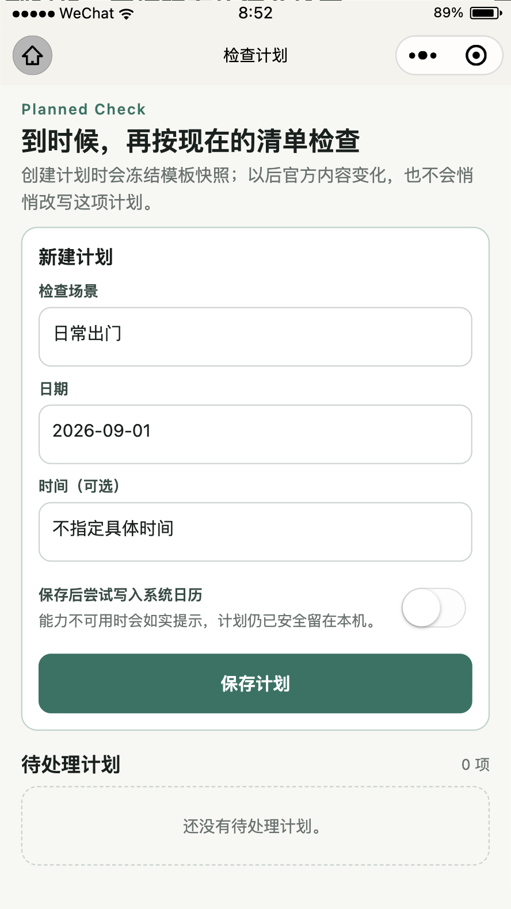

新建表单在 411px 宽度下完整显示；日期、时间、系统日历说明与保存按钮没有基线漂移或裁切。

### 2. 历史

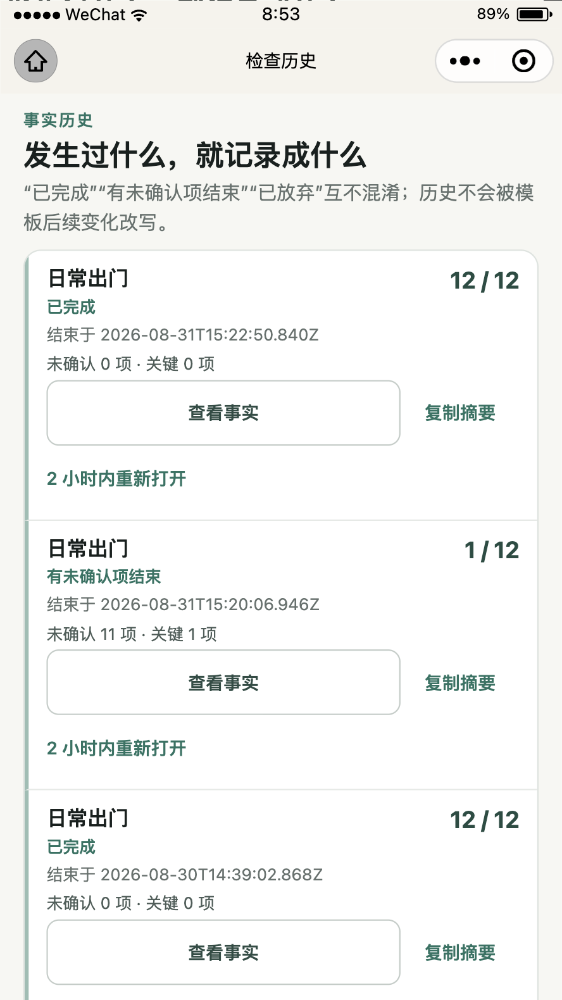

同一列表中“已完成”和“有未确认项结束”使用明确文字与事实计数，不依赖颜色单独传达状态。

### 3. 历史详情顶部

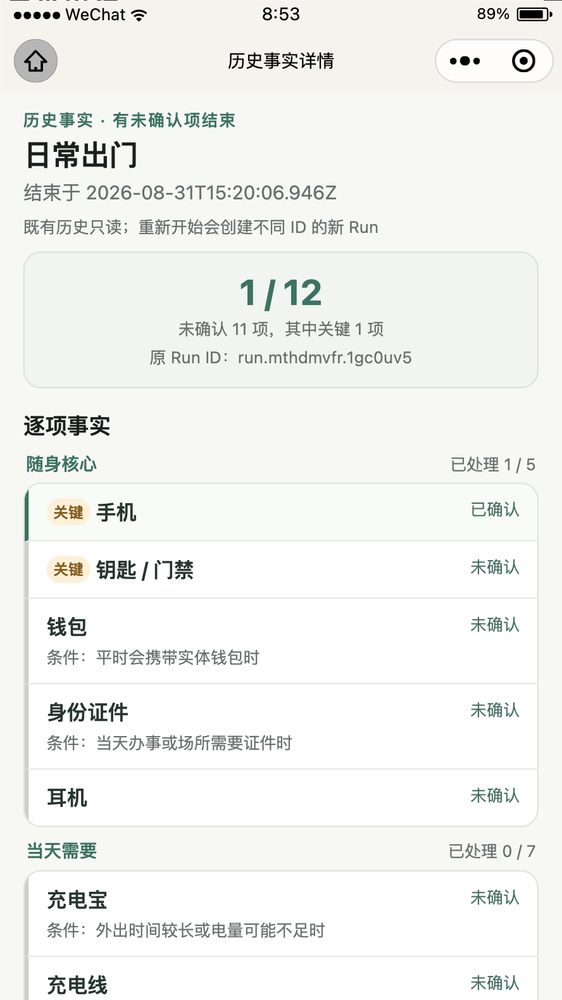

页面回读为 `1 / 12`、未确认 11、关键未确认 1；截图与冻结 Run 事实一致。

### 4. 历史详情后续操作

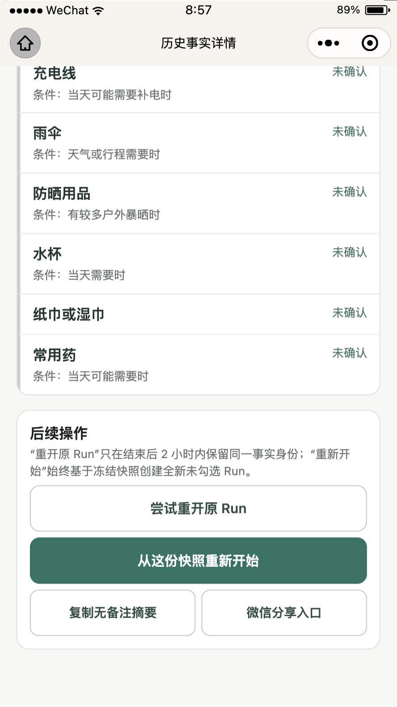

“尝试重开原 Run”保持次级，“从这份快照重新开始”保持主动作；复制与微信分享进一步降级为并列次级动作。

### 5. 数据与备份顶部

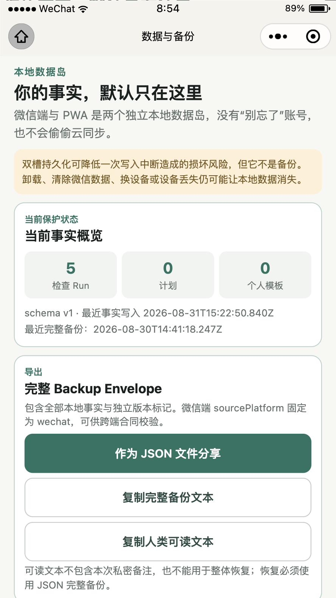

当前事实回读为 5 个 Run、0 项计划、0 个个人模板；双槽不是备份、PWA/微信独立数据岛等边界位于动作之前。

### 6. 数据高风险区

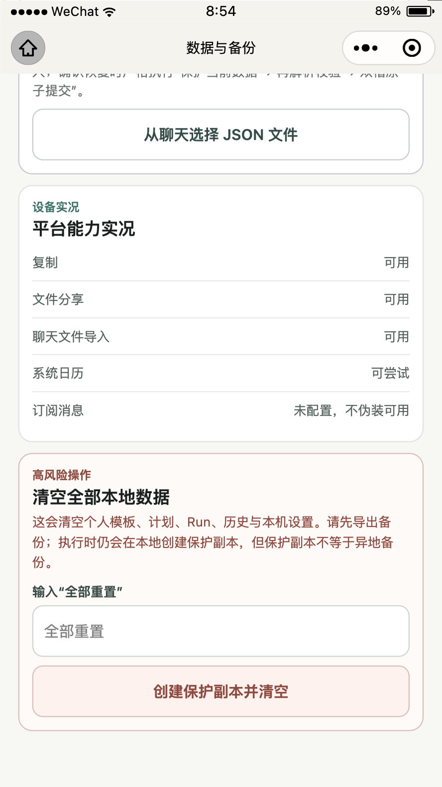

平台能力实况逐项呈现；清空操作需要输入“全部重置”，危险说明、输入框和危险按钮都在独立风险容器中。

### 7. 搜索结果

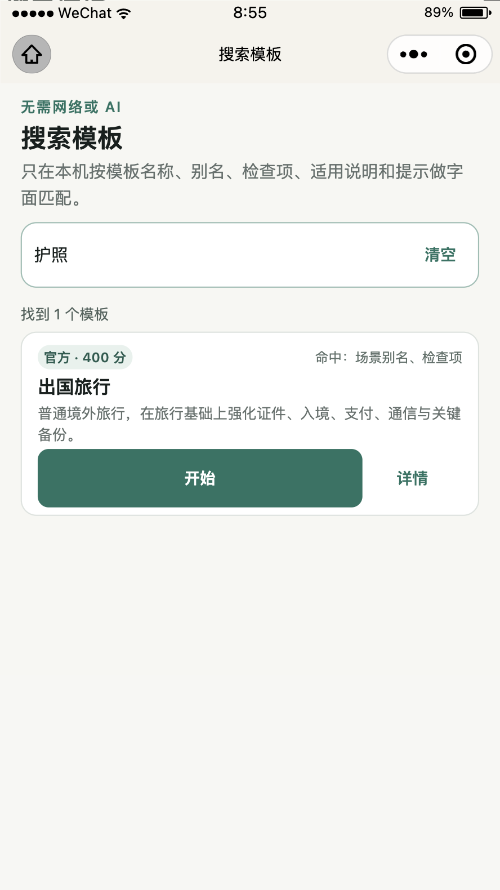

真实输入“护照”后，运行时返回 1 个官方模板，分数 400，命中“场景别名、检查项”；界面没有使用网络或 AI。

### 8. 全部进行中

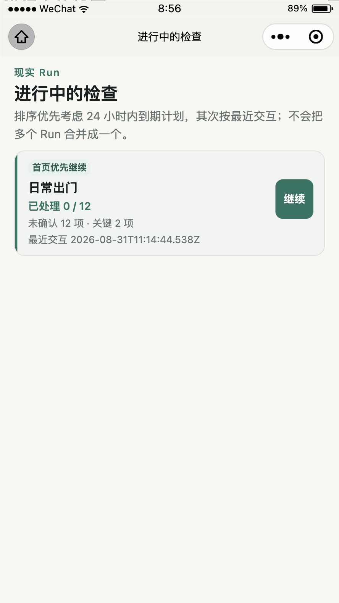

当前只有 `run.mth55nei.4f280b`，未确认 12、关键 2；页面明确把它标为首页优先继续，没有把它与历史或其他模板实例合并。

### 9. 模板编辑修复后默认状态

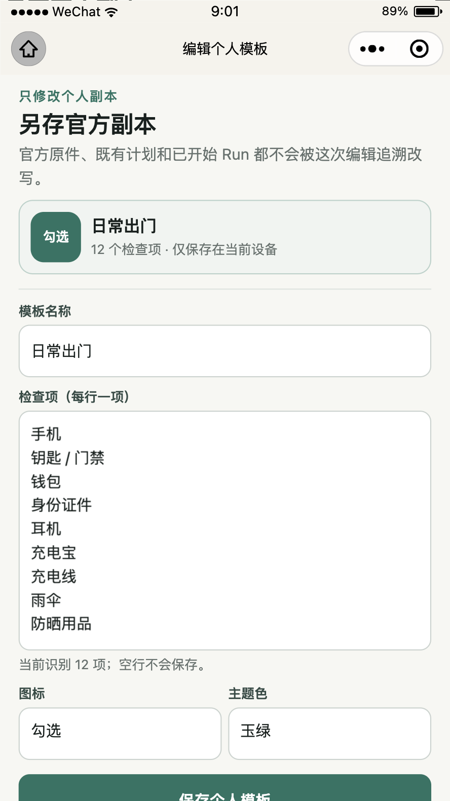

预览色块和两个 picker 均显示“勾选 / 玉绿”，不再暴露 `check / jade`。

### 10. 模板编辑修复后保存区

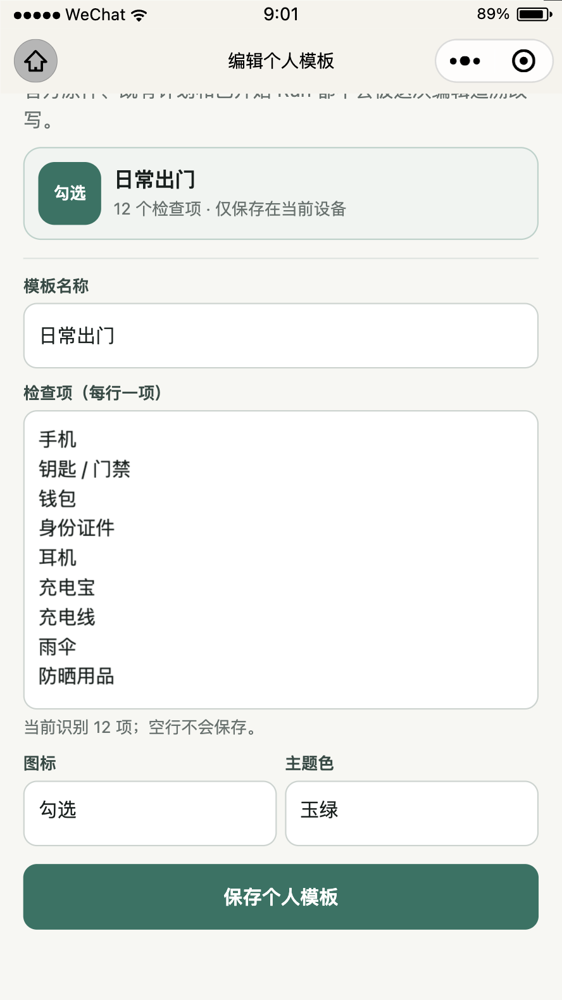

保存按钮 377 × 48px，文本域、帮助文案、图标和主题色 picker 在短屏 Android 上仍完整可达。

### 11. 模板编辑真实切换状态

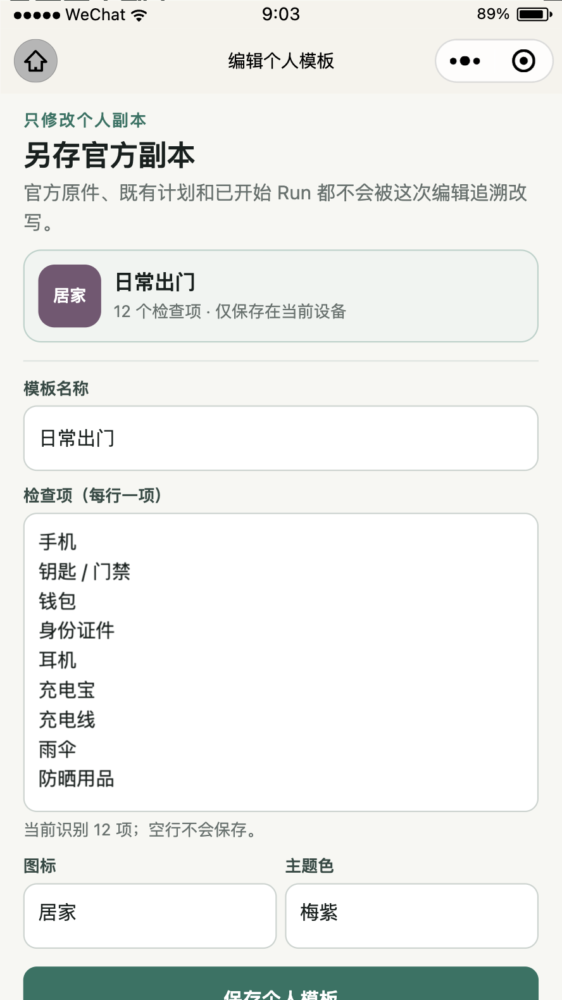

官方运行时调用真实页面方法切换到索引 2 / 3 后，页面回读为：

```text
icon             home
iconLabel        居家
themeColor        plum
themeColorLabel   梅紫
```

截图中的预览色与中文标签同步变化；未调用保存方法，因此没有创建或修改个人模板。

## P2 根因、测试与修复

### 可复现现象

修复前截图保留为 `07-template-edit-before-top-android.png` 与 `08-template-edit-before-bottom-android.png`。页面逻辑把字符串数组直接作为 picker 数据，并让 WXML 直接绑定 `{{icon}}` / `{{themeColor}}`，因此领域 token 被当作用户文案。

### 根因

领域值与展示值共用同一字段，没有独立的 presentation mapping。存储 token 本身正确，问题发生在微信页面 view model 与 WXML 绑定层。

### 测试先行

先新增 `tests/miniprogram/template-edit-page.test.ts`，要求：

1. 既有 `bag / ocean` 必须显示为“行李 / 海蓝”；
2. 选择索引 2 / 3 后必须显示“居家 / 梅紫”；
3. 同时原始值必须仍为 `home / plum`。

测试先以缺少 `iconLabel` / `themeColorLabel` 的预期原因失败，再以映射后的最小实现通过。最终全仓为 31 个测试文件、158 个测试全部通过。

### 实现边界

- 只修改 `miniprogram/pages/template-edit/` 的页面 view model 与 WXML；
- 不修改官方模板内容、个人模板 schema、备份结构、Run/Plan 语义或 PWA UI；
- 未使用远程字体、网络图标或新增运行时依赖；
- 对未知旧 token 仍保留原值作为兜底文案，不静默改写用户数据。

## 元素尺寸实测

| 页面 | 元素 | 官方运行时尺寸（px） |
|---|---|---:|
| 计划 | 保存计划 | 349 × 48 |
| 计划 | 日历说明行 | 349 × 56 |
| 历史 | 查看事实 | 259 × 48 |
| 历史 | 复制摘要 | 87 × 48 |
| 历史详情 | 从快照重新开始 | 349 × 48 |
| 历史详情 | 底部并列次级按钮 | 171.5 × 48 |
| 数据 | JSON 文件分享 | 351 × 48 |
| 数据 | 清空全部数据 | 351 × 48 |
| 搜索 | 搜索框外层 | 377 × 49 |
| 模板编辑 | 保存个人模板 | 377 × 48 |
| 模板编辑 | 单个 picker cell | 185.5 × 69.4 |
| 全部进行中 | 继续 | 46 × 48 |

所有本轮核心可点击区域达到至少 44px 高；搜索 input 内部排版高度为 43px，但完整可点击搜索框为 49px。截图未见中文按钮文字偏心、异常换行或横向裁切。本节不等同于屏幕阅读器或完整无障碍审计。

## 官方工具与全仓门禁

```text
官方 WXML / WXSS     11 页、22 / 22 PASS
console              error/warn/fail/exception 无匹配
network              空

runtime:check        PASS（Node.js 24 / pnpm 11.19.0）
frozen install       PASS（Already up to date）
content:check        PASS（Markdown = shared JSON = 微信派生 JS）
lint                 PASS
typecheck            PASS
test                 PASS（31 files, 158 tests）
build                PASS（35 precache entries, 573.51 KiB）
verify:boundaries    PASS（41 authored files, 40 production files）
miniprogram:verify   PASS（11 pages, 13 templates, 247764 bytes）
e2e                  PASS（8 / 8）
git diff --check     PASS
```

模板编辑器展示切换后重新进入数据页，事实仍为：

```text
checkRuns          5
plannedChecks      0
personalTemplates  0
schemaVersion      1
updatedAt          2026-08-31T15:22:50.840Z
```

因此这次视觉修复没有写入或改写领域事实。

## 预览与体验构建

全量门禁与官方模拟器复验通过后，使用同一测试号 `1.1.0` 重新执行：

```text
create_preview_qrcode  PASS（window，190070 bytes）
auto_preview           PASS（190070 bytes）
upload                 PASS（190569 bytes）
description            别忘了 V1.1 微信次级页面视觉复验与模板标签修复
```

第一次尝试把二维码输出到 `/tmp` 文件时，官方工具因输出路径校验返回错误；没有生成包、没有上传。按工具自身推荐改用 `qr-format=window` 后一次通过，随后自动预览与体验版上传均成功。

## 剩余边界

1. 物理 iPhone / Android 微信的全部 11 页手动回归仍需真实用户手势；本轮模拟器证据不能替代。
2. 较大微信字体档、屏幕阅读器、系统分享面板、聊天文件选择和系统日历授权不在本次截图结论内。
3. 当前仍是独立测试号体验构建，不是正式主体、生产 AppID、公众平台审核或正式发布。
4. 本轮没有改动 PWA 展示；PWA 的个人模板 token 呈现若要统一，应作为独立双端 UI 任务评估，不能把微信 view model 直接共享过去。
