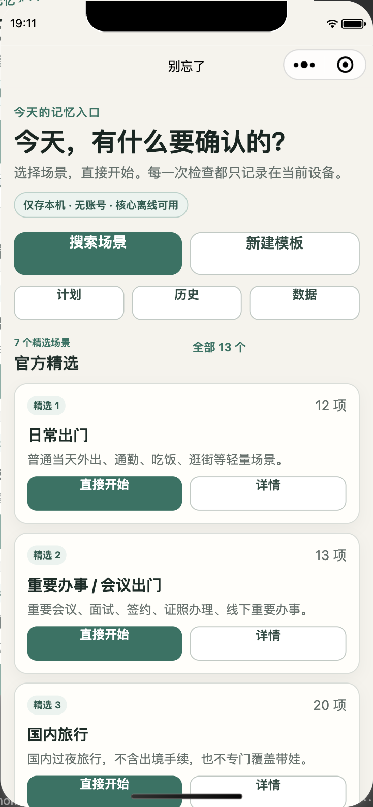
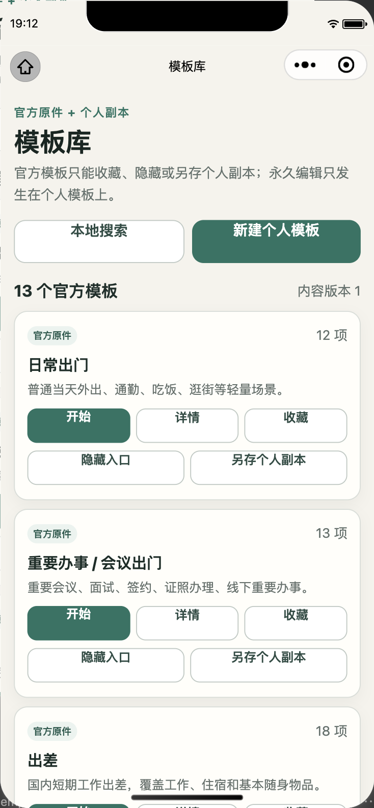
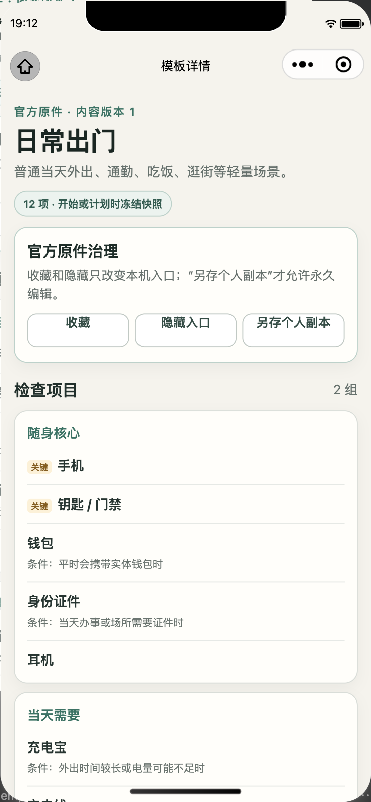
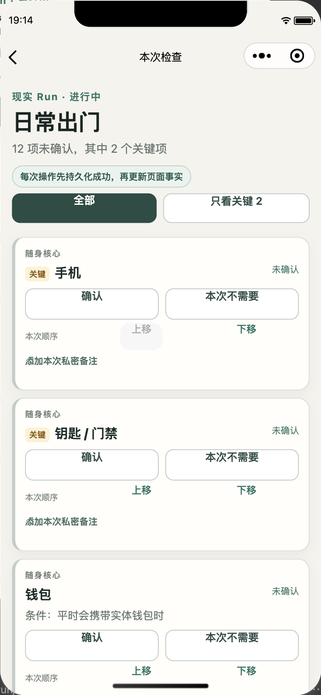

# 微信端视觉与排版审计（2026-08-31）

## 审计范围

- 产品面：微信原生小程序
- 用户任务：从首页选择场景，查看模板，开始并执行一次 Run
- 设备：微信开发者工具 iPhone 12/13 (Pro)，390 × 844，pixel ratio 3
- 微信字体设置：`fontSizeSetting = 16`（默认档）
- 工具：官方稳定版微信开发者工具 `2.02.2608060`
- 对照：`docs/design/visual-concept-v1.1.png`

本轮使用当前源码重新编译并逐步截图；不是复用 2026-08-30 的旧证据。

## 总体判断

用户反馈成立。当前问题不只是某个字偶发移位，而是全局视觉系统与冻结概念图存在系统性偏差：字号和字重整体偏大偏重、原生按钮文本基线缺乏稳定约束、卡片/边框/圆角使用过量、纵向密度过低、操作层级过度平铺。功能语义清楚，但视觉噪声使核心动作不够轻快。

## 步骤 1：首页

健康度：`needs-redesign`

可见优点：产品标题、Local-first 信任边界和主入口都能读懂；点击目标足够大。

主要风险：Hero、两排快捷按钮和“官方精选”标题占据过多首屏；几乎所有按钮都使用粗体和完整边框，主次差距不足；一张模板卡占用高度过大，首屏信息量明显低于冻结概念图。

## 步骤 2：模板库

健康度：`poor-density`

可见优点：官方原件与个人副本的语义边界明确。

主要风险：每个官方模板长期平铺 5 个操作，卡片成为“按钮面板”；较长按钮文案在不同字体实现或较大字号下容易换行/偏移；用户浏览 13 个模板需要大量滚动。冻结概念图使用紧凑列表与按需详情，信息密度显著更合理。

## 步骤 3：模板详情

健康度：`readable-but-heavy`

可见优点：治理说明与冻结快照边界表达清楚，关键项可识别。

主要风险：标题、治理卡、三等宽按钮和项目卡都使用强边界，视觉层级互相竞争；`关键` 徽标与项目标题依赖行内文本基线，已能看到轻微上下错位；大量非标准数值字重会在 iOS/Android 字体映射中产生不同结果。

## 步骤 4：Run

健康度：`core-flow-works-visual-friction-high`

可见优点：未确认数量、关键项、持久化承诺和项目状态都清楚；主要触控目标足够大。

主要风险：单个项目卡纵向空间过高，一屏只能看到约 2.5 项；重复边框、双按钮、排序按钮和备注入口形成强烈视觉噪声；`关键` 徽标、标题、状态三种文本共用一行，较大字号或 Android 字体度量下更容易基线错位和挤压。相比冻结概念图的分组清单，核对效率明显偏低。

## 跨页面根因

1. 全局样式使用 `650/680/720/730/760` 等非标准数值字重；不同微信内核和系统字体不一定映射一致。
2. 原生 `button` 只设置 `min-height` 与 `line-height: 1.3`，没有统一的 flex 居中内容层；中文字体度量和多行回流时容易出现视觉基线不齐。
3. 标题、正文、按钮与徽标的字号梯度过宽，且多数元素都加粗，导致页面显得“字大、字挤、字重”。
4. `28rpx` 卡片圆角、阴影、完整边框和大内边距高频重复，弱化了内容本身。
5. 行为没有错，但操作全部展开；模板库和 Run 没有把低频动作降级为次级入口。

## 可访问性风险与证据边界

- 正面：当前默认字体档下正文可读，颜色对比肉眼未见明显失败，触控面积充足。
- 风险：三等宽按钮、行内徽标 + 标题 + 状态组合，在微信较大字体档或 Android 字体下可能换行、截断或错位；需要整改后用至少默认/较大字体档和 iOS/Android 各一次复验。
- 限制：本轮证据来自官方 iOS 模拟器默认字体档，不能据此声称真机字体适配或完整 WCAG 合规。

## 建议优先级

1. 先统一排版与按钮基线：标准字重、明确行高、统一 flex 居中内容层、长文案回流规则。
2. 再恢复冻结概念图的信息密度：Home 入口紧凑化，模板改列表优先，Run 改分组清单优先。
3. 把收藏、隐藏、另存副本、排序和备注等低频动作降级到详情或展开区，保留原行为与官方文案。
4. 逐页回归 11 页，并用相同 390 × 844 视口复拍前后图；之后补 Android 与较大微信字体档。

审计没有改动产品运行时代码。视觉实施需先确认设计方向，且必须保持冻结文案、Local-first 边界、数据语义和持久化顺序不变。
