# 微信视觉整改对照审计（2026-08-31）

## 审计结论

`iOS default-font result: passed`

`HarmonyOS default-font result: passed`

`Android default-font result: passed`

`final result: passed`

本轮把相同设备和状态下的新截图同时与以下两类来源对照：

1. 冻结视觉目标：`docs/design/visual-concept-v1.1.png`；
2. 整改前同视口证据：`evidence/wechat/ui-audit-2026-08-31/01-home.png` 至 `04-run.png`。

iOS 默认字体档未发现仍需阻断的 P0、P1 或 P2。随后在 HUAWEI Mate 70 Pro / HarmonyOS、376 × 809、默认字体 16 下复拍首页和普通 Run，两页同样通过。

最后在 Nexus 5X / Android 5.0、411 × 731、默认字体 16 下重新编译并复拍首页和普通 Run；Android 截图与冻结概念图、整改前截图、iOS 和 HarmonyOS 结果同屏比较后，未发现中文基线漂移、按钮文字偏心、横向溢出、异常换行、Dock 遮挡或仍需阻断的 P0、P1、P2。该结论只覆盖官方模拟器默认字体档，不外推为物理手机或大字体无障碍结论。

## 审计环境

- 官方微信开发者工具：`2.02.2608060`
- WeChatLib：`3.17.2`
- 模拟设备：iPhone 12/13 (Pro) / HUAWEI Mate 70 Pro / Nexus 5X
- 系统：iOS 模拟档 / HarmonyOS / Android 5.0
- 逻辑屏幕：390 × 844 / 376 × 809 / 411 × 731
- pixel ratio：3 / 3.5 / 2.625
- 微信字体设置：16（默认档）
- 截图输出：原始 PNG；Android 为 888 × 1580
- 产品事实：独立测试号、本地数据岛、无产品账号与运行时网络

## 核心页面对照

| 页面 | 整改前问题 | 新实现可见结果 | 结论 |
|---|---|---|---|
| 首页 | Hero、五个强按钮和大模板卡竞争；一屏信息量低 | 主次入口分离；计划/历史/数据降为文字导航；继续 Run 和官方模板改为开放列表 | passed |
| 模板库 | 每行长期平铺五个操作；大卡片导致滚动成本高 | 列表只保留“开始 / 详情”；收藏、隐藏、另存副本进入详情；首屏可见四条以上模板标题 | passed |
| 模板详情 | 治理卡、三按钮和检查项卡片边界过重；关键徽标错位 | 治理动作仍集中但不与列表重复；分组开放列表；关键徽标、标题和状态基线最大差值小于 1px | passed |
| Run | 一屏约 2.5 项；排序和备注长期展开；非标准字重与按钮基线不稳 | 一屏完整显示至少四个项目标题；低频调整/备注按项展开；组计数、关键视图和底部 Dock 清晰 | passed |

## 九项视觉评分

| 维度 | 官方模拟器结果 | 证据判断 |
|---|---|---|
| 信息层级 | passed | 页面标题、事实摘要、主动作和低频动作层级明确，不再同权竞争 |
| 信息密度 | passed | 首页、模板库和 Run 的首屏可见内容显著增加；Run 达到至少四个完整标题 |
| 字体与字重 | passed | 运行样式只使用 400/500/600/700；未见旧版异常粗重或跨元素漂移 |
| 按钮基线 | passed | 主次按钮文本垂直居中；iOS / HarmonyOS / Android 状态按钮分别为 45 / 44 / 48px 高 |
| 间距 | passed | Hero、列表标题、组标题和 Dock 间距连续，无挤压或不必要的大空洞 |
| 边框与圆角 | passed | 列表内部用分隔线取代重复卡片；强边框仅保留给治理、回执和重要风险区域 |
| 安全区 | passed | 底部 Dock 位于 home indicator 之上；内容可滚动到 Dock 后方但标题与核心操作不被遮挡 |
| 长文案回流 | passed | “重要办事 / 会议出门”“另存个人副本”“本次不需要”等均完整显示且居中 |
| 交互可达性 | passed | 所有核心状态按钮至少 44px；关键筛选、确认、不需要、结束和回执入口均真实可操作 |

## 状态截图

### 1. 首页

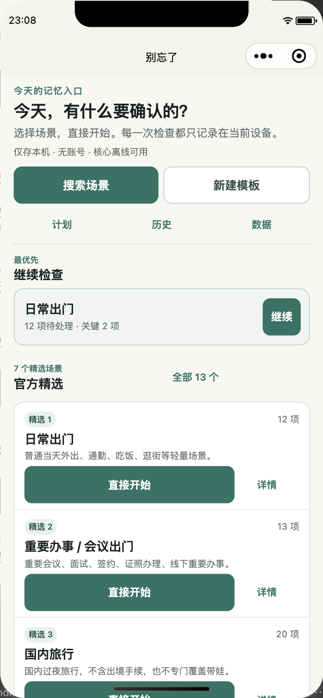

可见变化：首屏包含继续 Run 与官方模板入口，快捷导航不再以五个同权描边按钮占据主要空间。

### 2. 模板库

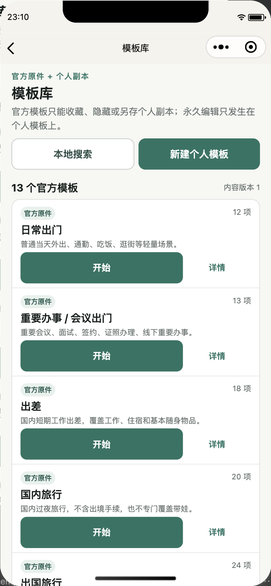

可见变化：每条官方模板只保留两个高频动作；模板之间使用分隔线，浏览密度明显高于整改前。

### 3. 模板详情

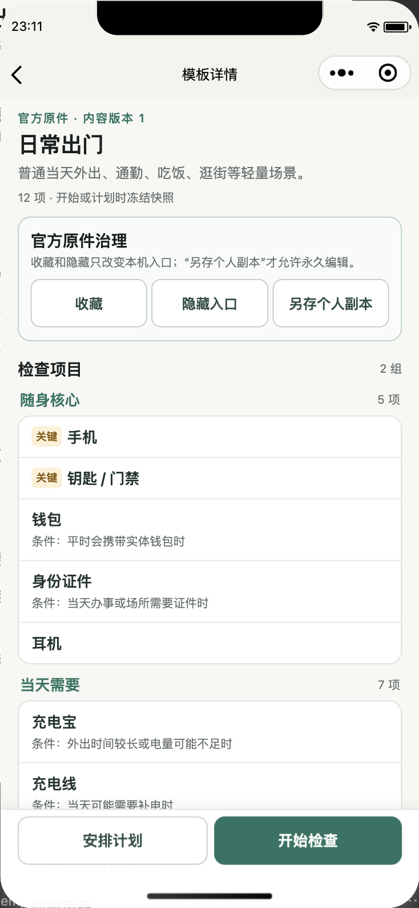

可见变化：关键徽标与标题对齐；分组标题、数量和检查项形成连续列表；底部动作固定且不压住内容标题。

### 4. 普通 Run

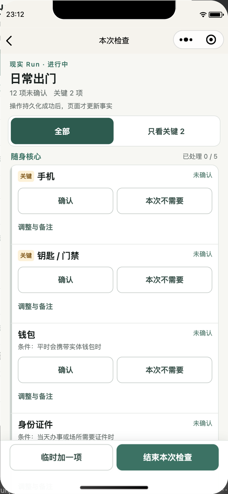

可见变化：Header、视图切换和四个完整项目标题同时可见；低频调整与备注被降为文字入口。

### 5. 只看关键

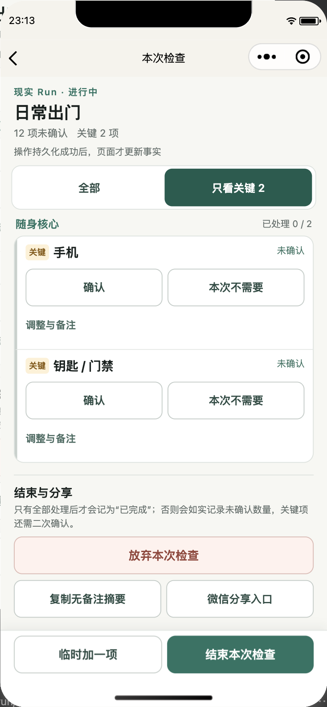

页面只显示 2 个关键项，但页头仍显示全部 Run 的 12 个未确认、2 个关键未确认；筛选没有改写事实。

### 6. 已确认与本次不需要

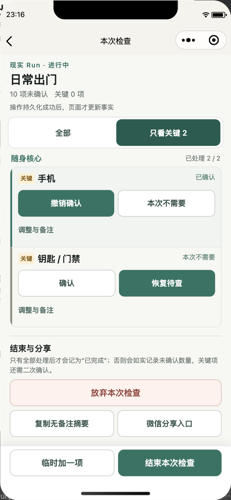

`confirmed` 与 `notNeeded` 使用不同的左侧状态色、按钮文案和背景，既可区分也不会把“不需要”伪装成“已确认”。

### 7. 有未确认项的结束确认

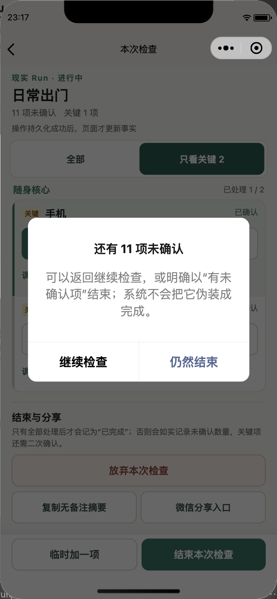

原生弹窗明确展示 11 项未确认，并说明不会伪装成完成。该截图来自真实 `wx.showModal`，不是 HTML/WXML 仿制层。

### 8. 全部处理回执

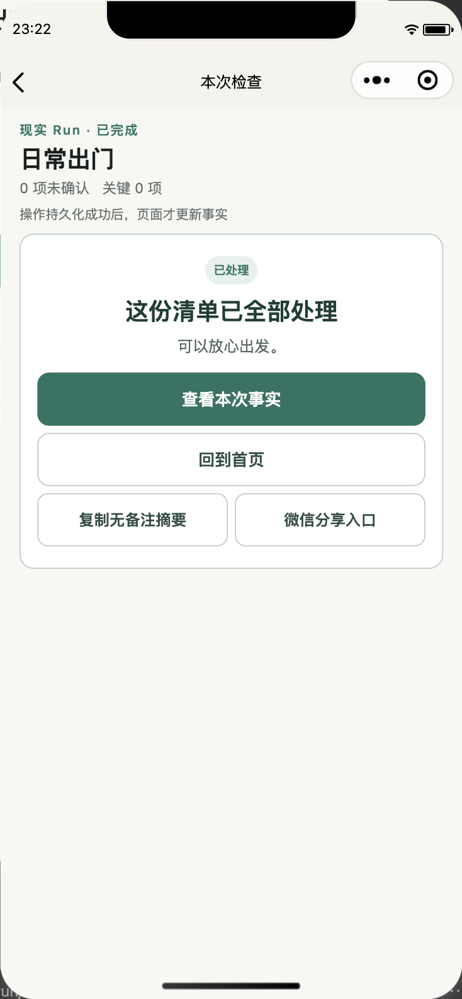

只有 12 项全部处理、未确认计数为 0 后才显示“这份清单已全部处理 / 可以放心出发”。

### 9. 有未确认项结束回执

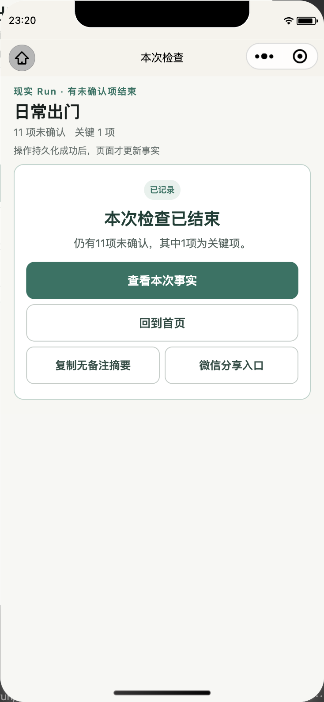

回执如实显示仍有 11 项未确认、其中 1 项为关键项，与关闭事件回读一致。

### 10. Huawei / HarmonyOS 首页

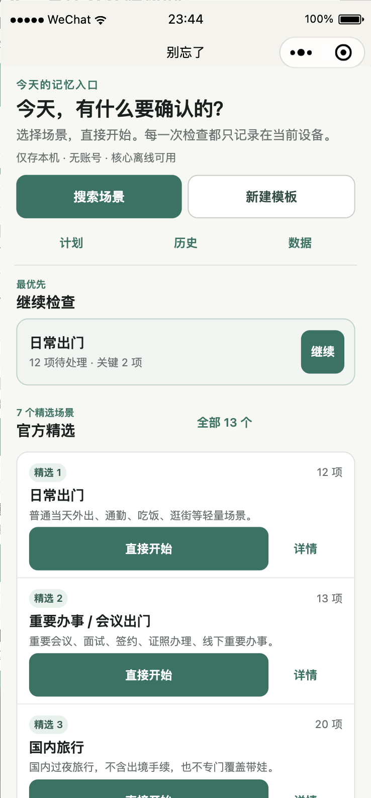

与 iOS 同屏对照后，标题、按钮和模板行未出现中文基线漂移、截断或横向溢出。HarmonyOS 状态栏高度不同，但内容从平台安全区下方正常开始。

### 11. Huawei / HarmonyOS Run

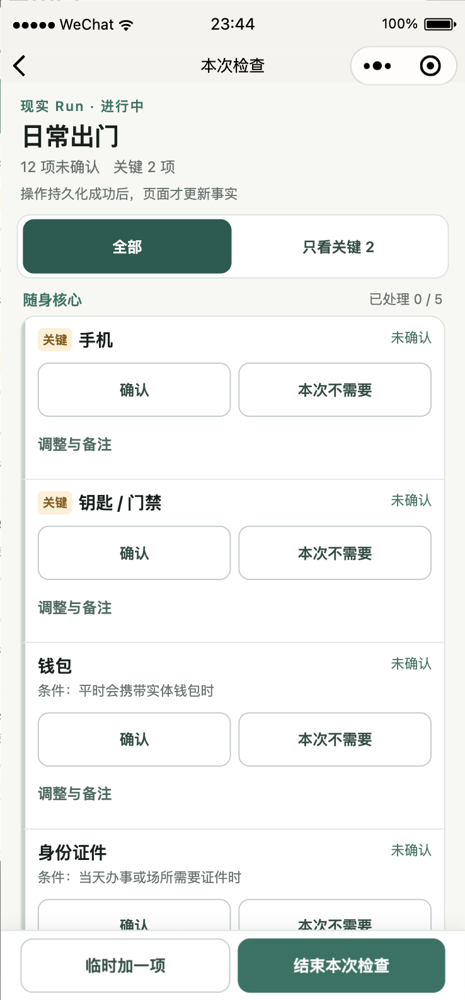

390 宽 iOS 与 376 宽 HarmonyOS 均能完整显示 Header、视图切换和至少四个项目标题。状态按钮恰好 44px 高；关键徽标、标题和状态 top offset 最大差值约 0.05px。

### 12. Nexus 5X / Android 首页

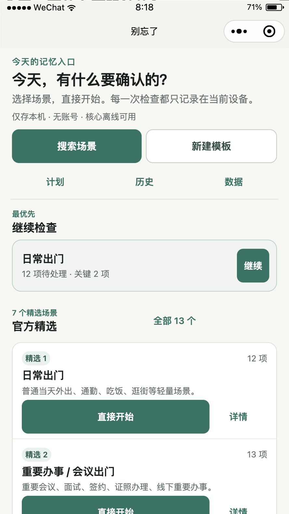

411 宽 Android 默认字体下，Hero、主次入口、继续 Run、官方模板标题和长适用文案均完整显示。与 iOS、HarmonyOS 同屏比较未见中文基线漂移、按钮偏心或横向裁切。

### 13. Nexus 5X / Android Run

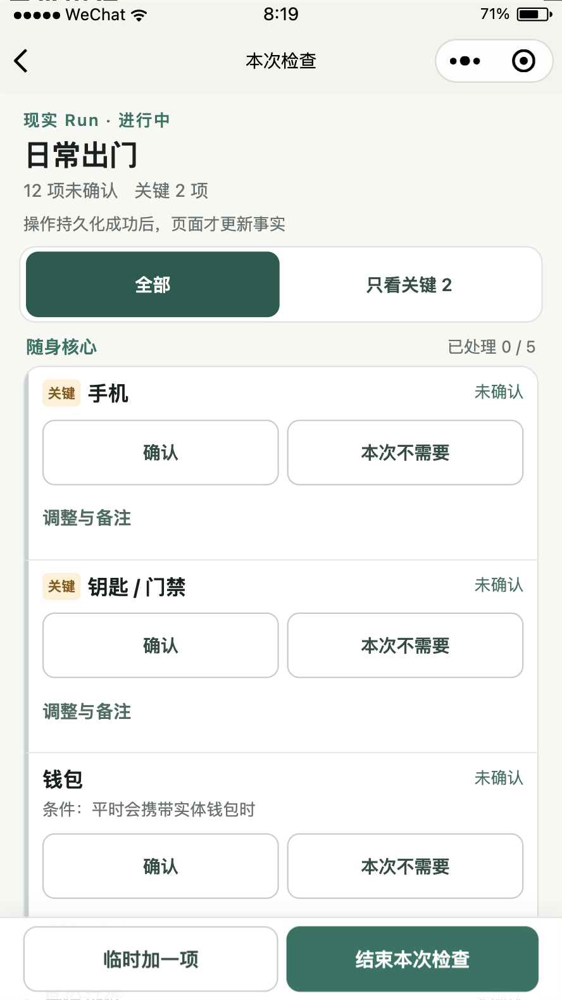

更短的 731 高视口仍完整显示 Header、视图切换、前三个项目和底部 Dock。状态、视图与 Dock 按钮均为 48px 高；关键徽标、项目标题、状态文字的 top offset 为 209.180 / 209.055 / 209.055px，最大差值约 0.13px。切换“只看关键”时只渲染 2 项，但总未确认与关键未确认仍为 12 / 2，恢复“全部”后事实不变。

## 相对冻结概念图的保留差异

以下差异属于冻结业务要求带来的必要实现，不列为视觉缺陷：

1. 概念图用单一复选框表达普通完成态；实际产品必须显式支持 `unchecked / confirmed / notNeeded` 三态，因此 Run 保留两个并列状态按钮。
2. 微信原生导航栏、右上角胶囊与底部 home indicator 由平台提供，不能按概念图任意重绘。
3. 官方模板的收藏、隐藏和另存个人副本属于冻结治理能力；本轮将它们从模板库行降级到详情，而不是删除。

## 剩余边界

- 官方模拟器默认字体视觉阻断项：无；iOS、HarmonyOS、Android 均通过。
- 首次 Android 截图在设备切换后出现“节点已就绪但渲染面首帧尚未绘制”的空白帧，已拒收；页面数据、WXML、尺寸和控制台均正常，等待 2 秒后的正式原始 PNG 已逐张检查并接受。
- 尚未外推：物理 iPhone / Android 微信完整回归、较大微信字体档、屏幕阅读器、系统文件分享、聊天文件选择、系统日历授权、平台审核与正式发布。
- 测试号 `1.1.0` 体验构建已在本审计通过后上传成功；正式发布边界见 `docs/deployment/wechat.md`。
